# Redstone Filters

Redstone Filters are used to change the behavior of [[Redstone Conduits|Redstone Conduit]].

## Redstone Filter Base
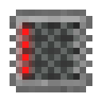

* Used to craft the other Redstone Filters.
* *Cannot* be used inside the [[Redstone Conduits|Redstone Conduit]].

## Redstone NOT Filter

* Used inside the *Output Filter Upgrade slot* of the [[Redstone Conduits|Redstone Conduit]].
* ***Inverts*** the Input Signal(s).
* It always Outputs a Signal Strength of 15.

### Table of the NOT Filter

| Input Signal | Output Signal |
| :----------: | :-----------: |
|      0       |       0       |
|      0       |       1       |
|      1       |       1       |
|      1       |       1       |

## Redstone OR Filter
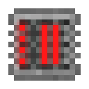

* Used inside the *Output Filter Upgrade* slot of the [[Redstone Conduits|Redstone Conduit]].
* Listens for Input Signal on 2 Channels.
* Channels can be configured by Editing Filter Settings in the [[Redstone Conduit]] GUI.
* Outputs Signal if it **receives** Input Signal on **any** configured Channel.
* It always Outputs a Signal Strength of 15.

### Table of the OR Filter

| Input Signal 1 | Input Signal 2 | Output Signal |
| :------------: | :------------: | :-----------: |
|       0        |       0        |       0       |
|       0        |       1        |       1       |
|       1        |       0        |       1       |
|       1        |       1        |       1       |

## Redstone AND Filter
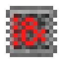

* Used inside the *Output Filter Upgrade* slot of the [[Redstone Conduits|Redstone Conduit]].
* Listens for Input Signal on 2 Channels.
* Channels can be configured by Editing Filter Settings in the [[Redstone Conduit]] GUI.
* Outputs Signal if it **receives** Input Signal on **both** configured Channels.
* It always Outputs a Signal Strength of 15.

### Table of the AND Filter

| Input Signal 1 | Input Signal 2 | Output Signal |
| :------------: | :------------: | :-----------: |
|       0        |       0        |       0       |
|       0        |       1        |       0       |
|       1        |       0        |       0       |
|       1        |       1        |       1       |

## Redstone NOR Filter
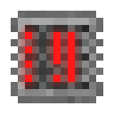

* An inverted [Redstone OR Filter](#redstone-or-filter).
* Used inside the *Output Filter Upgrade* slot of the [[Redstone Conduits|Redstone Conduit]].
* Listens for Input Signal on 2 Channels.
* Channels can be configured by Editing Filter Settings in the [[Redstone Conduit]] GUI.
* Outputs Signal if it **doesn't receive** Input Signal on **any** configured Channel.
* It always Outputs a Signal Strength of 15.

### Table of the NOR Filter

| Input Signal 1 | Input Signal 2 | Output Signal |
| :------------: | :------------: | :-----------: |
|       0        |       0        |       1       |
|       0        |       1        |       0       |
|       1        |       0        |       0       |
|       1        |       1        |       0       |

## Redstone NAND Filter
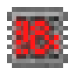

* An inverted [Redstone AND Filter](#redstone-and-filter).
* Used inside the *Output Filter Upgrade* slot of the [[Redstone Conduits|Redstone Conduit]].
* Listens for Input Signal on 2 Channels.
* Channels can be configured by Editing Filter Settings in the [[Redstone Conduit]] GUI.
* Outputs Signal if it **doesn't receive** Input Signal on **both** configured Channels.
* It always Outputs a Signal Strength of 15.

### Table of the NAND Filter

| Input Signal 1 | Input Signal 2 | Output Signal |
| :------------: | :------------: | :-----------: |
|       0        |       0        |       1       |
|       0        |       1        |       1       |
|       1        |       0        |       1       |
|       1        |       1        |       0       |

## Redstone XOR Filter
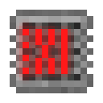

* Used inside the *Output Filter Upgrade* slot of the [[Redstone Conduits|Redstone Conduit]].
* Listens for Input Signal on 2 Channels.
* Channels can be configured by Editing Filter Settings in the [[Redstone Conduit]] GUI.
* Outputs Signal if it **receives** Input Signal on **any but not both** configured Channels.
* It always Outputs a Signal Strength of 15.

### Table of the XOR Filter

| Input Signal 1 | Input Signal 2 | Output Signal |
| :------------: | :------------: | :-----------: |
|       0        |       0        |       0       |
|       0        |       1        |       1       |
|       1        |       0        |       1       |
|       1        |       1        |       0       |

## Redstone XNOR Filter
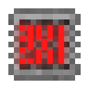

* An inverted [Redstone XOR Filter](#redstone-xor-filter).
* Used inside the *Output Filter Upgrade* slot of the [[Redstone Conduits|Redstone Conduit]].
* Listens for Input Signal on 2 Channels.
* Channels can be configured by Editing Filter Settings in the [[Redstone Conduit]] GUI.
* Outputs Signal if it **doesn't receive** Redstone Signal on **both** of the configured Channels or if it **receives** Input Signal on **both** configured Channels.
* It always Outputs a Signal Strength of 15.

### Table of the XNOR Filter

| Input Signal 1 | Input Signal 2 | Output Signal |
| :------------: | :------------: | :-----------: |
|       0        |       0        |       1       |
|       0        |       1        |       0       |
|       1        |       0        |       0       |
|       1        |       1        |       1       |

## Redstone Toggle Latch Filter
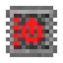

* Used inside the *Output Filter Upgrade* slot of the [[Redstone Conduits|Redstone Conduit]].
* Works as a T Flip-Flop.
* It toggles the Output Signal every time it receives an Input Signal.
* It always Outputs a Signal Strength of 15.

## Redstone Counting Filter
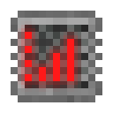

* Used inside the *Output Filter Upgrade* slot of the [[Redstone Conduits|Redstone Conduit]].
* The ***Count*** can be configured by Editing Filter Settings in the [[Redstone Conduit]] GUI.
* Outputs Signal every time it receives ***Count*** Input Signals.
* Initially, the *Counter* is set to 0.
* The first Input Signal after ***Count*** Input Signals resets the *Counter* to 1, so it is counted as an Input Signal.
* It always Outputs a Signal Strength of 15.

## Redstone Sensor Filter
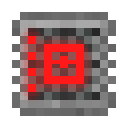

* Used inside the *Input Filter Upgrade* slot of the [[Redstone Conduits|Redstone Conduit]].
* Works like a [Comparator that measures block state](https://minecraft.gamepedia.com/Redstone_Comparator#Measure_block_state).
* It transmits a Signal Strength in proportion to how full the container is (0 for empty, 15 for full, etc.).
* It can also measure [some non-container blocks](https://minecraft.gamepedia.com/Redstone_Comparator#Miscellaneous) that can be measured by the Redstone Comparator.

## Redstone Timer Filter
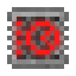

* Used inside the *Input Filter Upgrade* slot of the [[Redstone Conduits|Redstone Conduit]].
* The ***Time*** can be configured by Editing Filter Settings in the [[Redstone Conduit]] GUI.
* It transmits a Signal every ***Time*** game ticks.
* It can be disabled by powering the [[Redstone Conduit]] that contains it with a Redstone Signal.
* It always transmits a Signal Strength of 15.